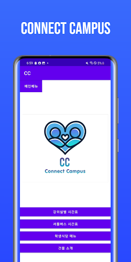
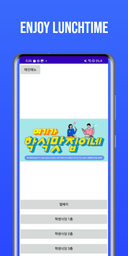
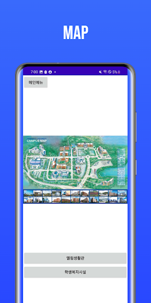
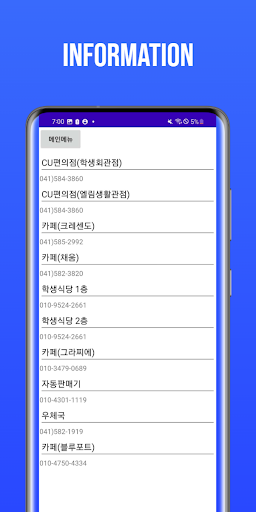

# 남서울대학교 재학생들을 위한 애플리케이션

## 소개
졸업작품으로 제작된 어플리케이션입니다. 현재 구글 플레이 스토어에서 다운로드 가능합니다

### 스크린샷
  

    
    
    
    
    

## 역할
CC 어플리케이션의 기획과 제작을 담당하였습니다.

남서울대학교 재학생들을 위해 설계된 이 애플리케이션은 학내 생활을 더욱 편리하게 지원합니다. 학생들은 다음과 같은 기능을 통해 학교 생활을 원활하게 관리할 수 있습니다:

- **강의실별 시간표**
- **셔틀버스 시간표**
- **학생식당 메뉴**
- **건물 정보**

## 기능

### 강의실별 시간표

- **기능**: 각 강의실의 시간표를 조회할 수 있습니다.
- **설명**: 강의실 번호를 입력하면 해당 강의실의 시간표를 확인할 수 있습니다. 시간표는 주간 단위로 업데이트됩니다.

### 셔틀버스 시간표

- **기능**: 셔틀버스의 운행 시간과 경로를 제공합니다.
- **설명**: 각 셔틀버스 노선의 운행 시간과 경로를 확인할 수 있으며, 실시간 위치 추적 기능도 지원될 예정입니다.

### 학생식당 메뉴

- **기능**: 학생식당의 메뉴를 제공합니다.
- **설명**: 매일마다 바뀌는 식단의 정보를 볼 수 있습니다.

### 건물 정보

- **기능**: 각 건물의 위치 및 정보를 제공합니다.
- **설명**: 건물의 위치, 연락처, 사용 가능한 시설에 대한 정보를 제공하며, 지도 기능을 통해 건물 위치를 쉽게 찾을 수 있습니다.

## 설치 및 실행

1. **다운로드**: 애플리케이션은 구글스토어에서 다운로드 할 수 있습니다.
2. **설치**: 다운로드한 파일을 실행하여 애플리케이션을 설치합니다.

   
https://play.google.com/store/apps/details?id=mainpackage.example.afinal&hl=en-US&ah=0WbH30zODJgyWvzZEr4Ybztnza0
## 기여

이 애플리케이션은 사용자의 편의를 위해 지속적으로 개선될 예정입니다. 피드백이나 개선 사항이 있으시면 아래의 연락처로 제안해 주세요:

- **이메일**: [disney1026@naver.com], [disney1026dlxogus@gmail.com]
- **기타 문의**: 애플리케이션 내 고객 지원 기능을 통해 문의하실 수 있습니다.

## 연락처

- **개발자**: 이태현, 소영재, 윤주찬
